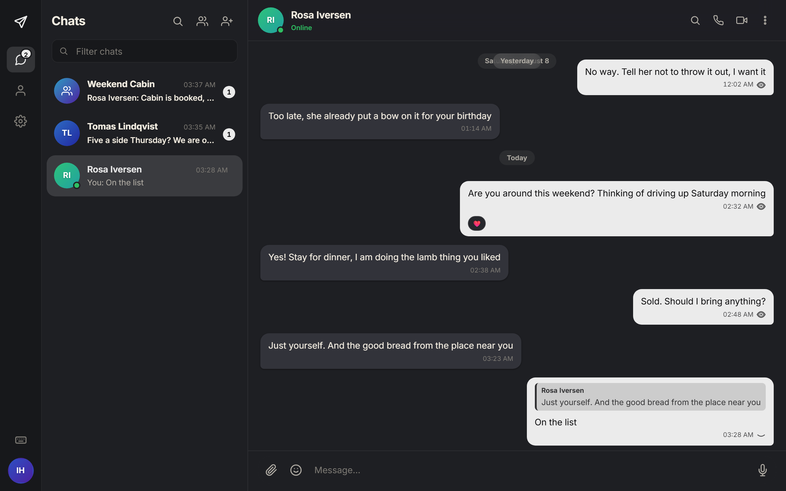
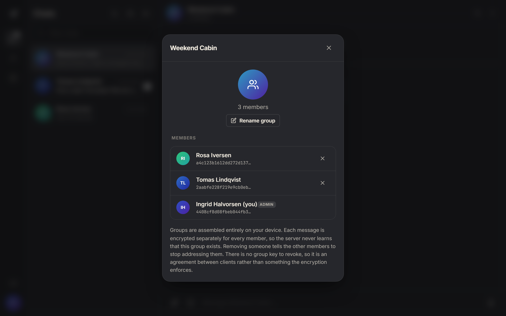
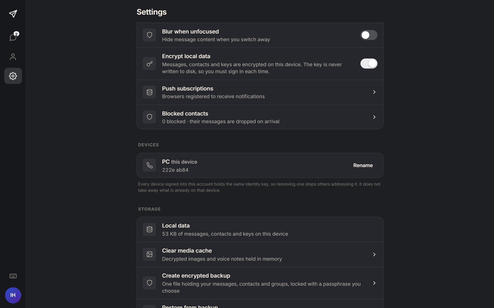
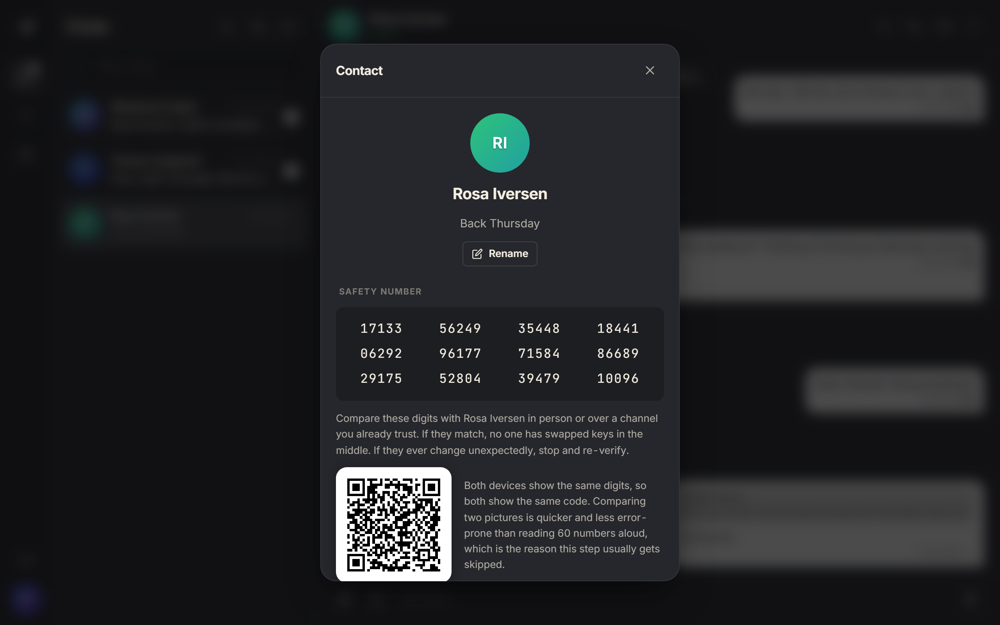
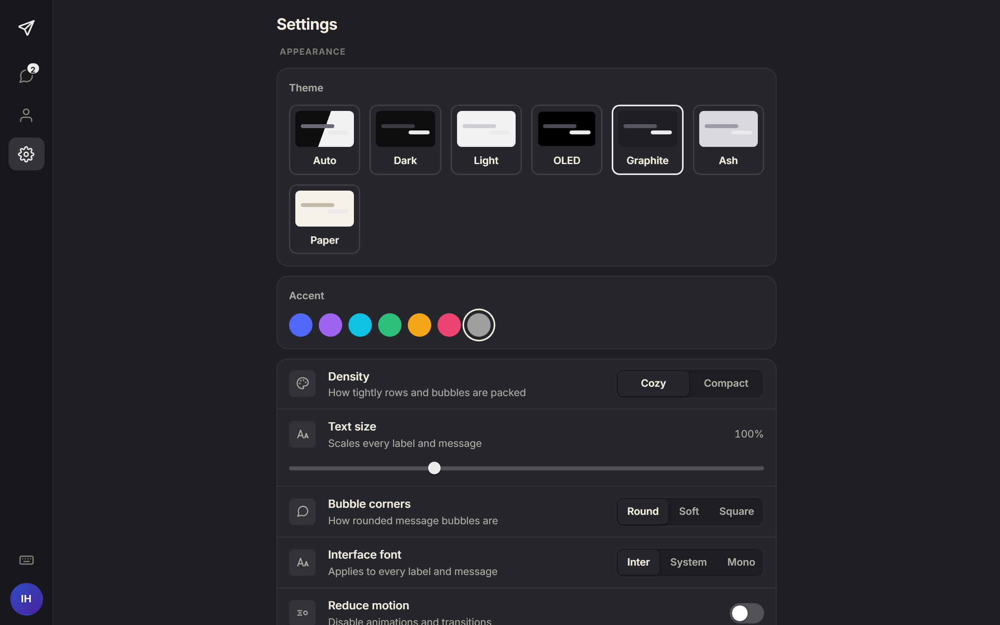
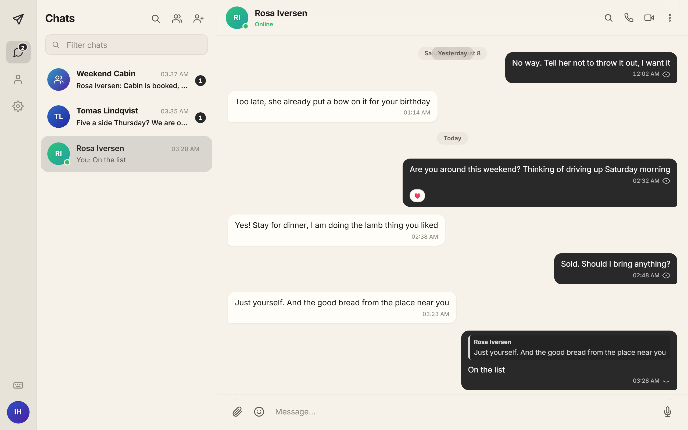
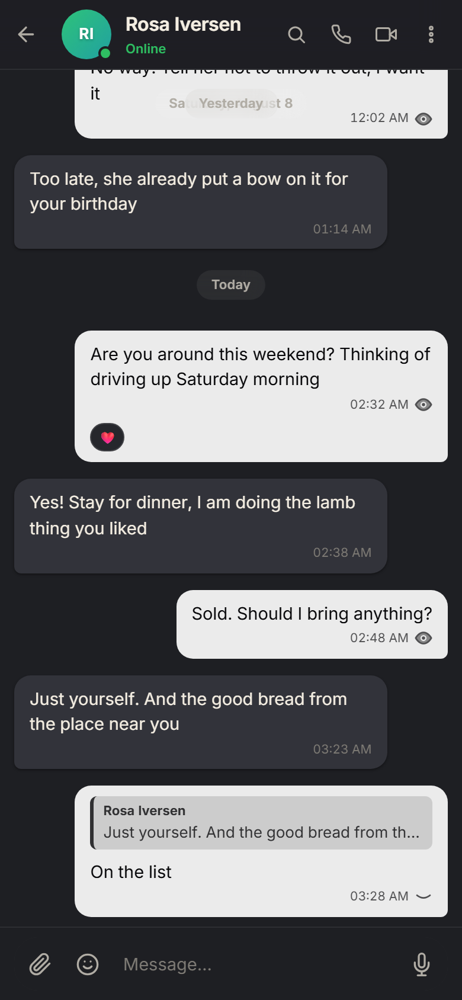
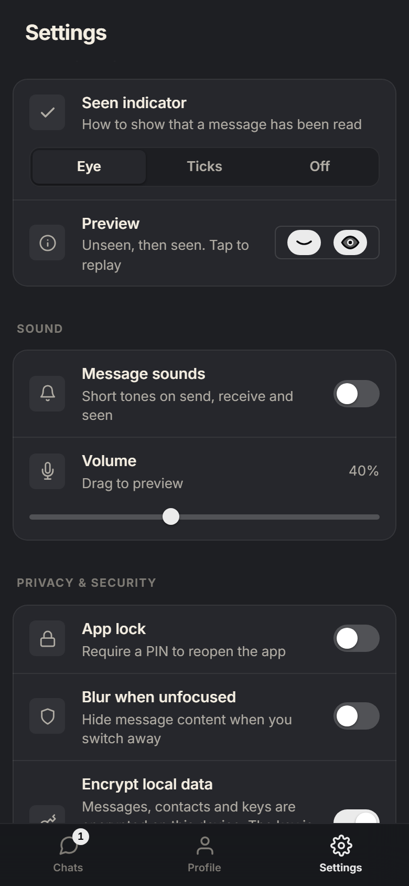

# Talon

**An end-to-end encrypted messenger you host yourself**

For the handful of devices you actually own. No phone number, no accounts
anywhere but your own machine, no company in the middle. Just a deliberately
dumb relay running on your hardware.

[](LICENSE)
[](https://nodejs.org)
[](#tests)
[](#verifying-the-build)



</div>

---

## Contents

- [What it is](#what-it-is)
- [What it is not](#what-it-is-not)
- [Quick start](#quick-start)
- [Trusting the certificate](#trusting-the-certificate)
- [Screenshots](#screenshots)
- [Features](#features)
- [What the relay can and cannot see](#what-the-relay-can-and-cannot-see)
- [Cryptography](#cryptography)
- [Known limitations](#known-limitations)
- [Repository layout](#repository-layout)
- [Tests](#tests)
- [Verifying the build](#verifying-the-build)
- [Configuration](#configuration)
- [Documentation](#documentation)
- [Reporting a vulnerability](#reporting-a-vulnerability)
- [License](#license)

---

## What it is

Two programs and no services.

**The relay** is a deliberately stupid Node process, roughly 1,500 lines with
three dependencies, that stores and forwards encrypted blobs. It has no idea
what a message says, who is in a group, or what your contacts are called.

**The client** is a vanilla-JavaScript progressive web app, served by that same
relay, which holds every key and does every encryption and decryption locally.

There is no third party anywhere. No push service sees your content, no CDN
serves your code, and no directory maps a name to a key, because a contact's
address *is* their public key.

> **In one sentence:** if someone compromised the relay completely they would
> learn *who is talking to whom and roughly when*, but never *what was said*.

## What it is not

Worth being blunt about, because a messenger that overstates its guarantees is
worse than one that is honest about its limits.

- **It does not hide metadata, and it cannot.** A relay that routes has to know
  where to route. Message lengths are padded; timing is not hidden.
- **It is not audited.** It is a personal project, read it yourself.
- **It is not a group chat product.** Groups exist and are signed, but there is
  no group key, so removing someone stops others addressing them rather than
  revoking what they already have.
- **With two users the anonymity set is two.** No amount of sealed sender fixes
  that; the structural protection is that you own the relay.

---

## Quick start

Requires **Node 20 or newer**. Nothing else.

```bash
git clone https://github.com/xsdbs/talon-main.git talon
cd talon

cd server && npm install
cd ../web  && npm install && npm run build

cd ../server && npm start
```

The relay prints every address it can be reached on:

```
Talon E2E Encrypted Messenger: Server Active

 [HTTP]   http://localhost:8080          (local)
 [HTTPS]  https://localhost:8443         (local, camera/mic OK)
 [HTTPS]  https://100.93.14.2:8443       (tailnet)
```

Open the **HTTPS** address and register. Camera, microphone, notifications and
the installable app all require a secure context; plain HTTP works for a quick
look and nothing else.

To reach your relay from outside the house without opening a port, install
[Tailscale](https://tailscale.com) on the relay machine and on each device. If
Tailscale gives it a MagicDNS name, include it so the certificate covers it:

```bash
TALON_EXTRA_SANS=talon.your-tailnet.ts.net npm start
```

---

## Trusting the certificate

A self-signed leaf cannot be trusted by a browser no matter what you click, so
the relay runs its own small certificate authority:

```
Talon Local CA  (10 years)  ->  leaf certificate  (397 days, auto-renewed)
```

Open `https://<your-relay>:8443/setup` on each device. That page is served by
the relay, detects the platform, and gives exact steps. You do it once and then
forget it exists.

Two things people trip over:

- **On iOS, installing the profile is only half of it.** You must also enable it
  under *General → About → Certificate Trust Settings*.
- **Firefox keeps its own certificate store** and ignores the system one.

> **397 days is a hard browser ceiling**, not a preference. Safari, iOS and
> Chrome reject any leaf valid longer than 398 days, trusted or not.

> ⚠️ A trusted root CA can vouch for *any* site. This one is generated on your
> machine and its private key never leaves `server/data/certs/ca-key.pem`.
> That file is the most sensitive thing in the installation.

---

## Screenshots

Every image is the running app, captured by `site/tools/capture-shots.mjs`.

<div align="center">

| Conversation | Groups |
|---|---|
|  |  |

| Devices | Verification |
|---|---|
|  |  |

| Settings | Light theme |
|---|---|
|  |  |





</div>

---

## Features

- **No identifier of any kind.** A username and a password that never leave the
  device. No phone number, no email, nothing to verify.
- **Modern protocol.** X3DH, the Double Ratchet, and an ML-KEM-768
  post-quantum hybrid.
- **Multiple devices.** Sign in again on another device. It publishes itself,
  gets its own sessions, and messages you send are mirrored to it.
- **Encrypted at rest by default**, on new accounts and on any device signing
  in for the first time.
- **Nothing sent can vanish.** Every message ends acknowledged, waiting in the
  outbox, or visibly failed with a retry.
- **Signed group rosters.** A member cannot forge one or edit it in transit.
- **Attachments, voice notes, replies, reactions, edits, disappearing
  messages**, and peer-to-peer voice and video.
- **Push notifications** that carry one opaque tag and nothing else.
- **Encrypted backups**: one file, a passphrase you choose.
- **Panic wipe** on three Escape presses.
- **Installable** on Android, iOS and desktop, and works offline.

---

## What the relay can and cannot see

**It does see:**

- The recipient of every envelope. That is what routing is.
- The sender, while the socket is open, because the connection is
  authenticated per identity.
- Timing and volume.
- Which of your devices a message is addressed to.
- Ratchet headers, and public prekey material peers fetch.
- A salted password verifier that cannot be replayed as a login.

**It never sees:**

- Message content of any kind.
- Contact or group names, avatars, or your display name.
- Any private key, including the identity key it stores for you as ciphertext.
- Your password, or anything from which it could be derived.
- That a group exists. Groups are client-side fan-out.
- Which conversation an envelope belongs to, or which ones you have muted.
- Who sent anything it wrote down: the offline queue, the access log and push
  payloads all store the sender as null.
- When a queued message was written. The queue records a day, not a clock.

**The log is redacted by default.** Identities print as an HMAC pseudonym under
a salt generated at boot and never written down, addresses collapse to
`local`/`tailnet`/`remote`, and routing pairs are never printed together.
`TALON_LOG_PRIVACY=full` restores verbatim logging for debugging.

---

## Cryptography

| Layer | What is used |
|---|---|
| Password | PBKDF2-SHA256, 600,000 iterations, 16-byte random salt, via WebCrypto |
| Handshake | X3DH: four Diffie-Hellman values through HKDF |
| Post-quantum | ML-KEM-768, mixed additively alongside X25519 |
| Messages | Double Ratchet, AES-256-GCM, a fresh key per message |
| Length | Padded to 256-byte buckets before encryption |
| Sender | Sealed inside an AEAD addressed to the recipient |
| At rest | AES-GCM under a key derived from your password, held in memory only |
| Backups | AES-256-GCM, PBKDF2 then HKDF, header bound in as associated data |

Three details that are load-bearing and easy to undo by accident:

- **The signed prekey's signature must be verified before use.** It is the only
  thing stopping the relay substituting its own prekeys.
- **The one-time prekey is deleted on use.** That deletion is what provides
  forward secrecy against a later identity-key compromise.
- **Every counter in an envelope header is attacker-controlled**, so every loop
  driven by one is bounded. Removing a bound reintroduces an unauthenticated
  remote denial of service. This was a real bug, not a hypothetical.

Argon2id was measured and rejected: the only browser implementation is pure
JavaScript and lands in the multi-second range on a mid-range phone, while
WebCrypto's PBKDF2 is native. An attacker cracking offline uses a native
implementation either way, so choosing the primitive the browser accelerates
avoids the defender paying a penalty the attacker never pays.

---

## Known limitations

These are real and deliberate. Do not assume otherwise.

- **Sealed sender is partial.** Nothing the relay *persists* records who sent
  what, but a running, malicious relay still knows which socket a frame arrived
  on. This buys privacy at rest and in logs, not anonymity against a live
  adversary.
- **Removing a device is not revoking it.** Peers stop addressing it; the
  messages and keys already on it stay there.
- **Group rosters are signed, but a first invitation is trust on first use**,
  and there is no group key.
- **The app-lock PIN is a UI gate.** It protects nothing cryptographically.
- **Trust on first use.** Compare safety numbers out of band to close it. There
  is no directory that could substitute a key afterwards.
- **A backup is only as strong as its passphrase**, with no rate limit in front
  of it and no recovery.
- **Accounts created before encryption at rest existed** have plaintext blobs on
  disk and are left alone rather than switched over silently.

---

## Repository layout

```
server/            The relay. Three dependencies.
  server.js        Static files, REST, WebSocket relay, all logging
  db.js            Persistence: the db.json snapshot plus the db.log journal
  tls.js           The local CA and leaf certificate lifecycle
  redact.js        Log redaction
  push.js          VAPID keys and Web Push
  ratelimit.js     Token buckets
  test/            Relay suites, run against a throwaway data directory

web/
  src/             The client source you read
  public/          What the relay serves, including the built bundle
  test/            Protocol, backup, vault, roster, device and fan-out suites

docs/              Engineering reference and images
```

`web/public/js/app.js` is a **generated, minified artifact**. Never edit it;
edit `web/src/` and rebuild.

---

## Tests

```bash
cd web    && npm test    # 257 tests
cd server && npm test    # 134 tests
```

Both use Node's built-in test runner. **There is no test-runner dependency and
there should not be one.** The relay suites spawn a real relay against a
throwaway data directory, so they can never touch live accounts or regenerate
the certificate authority.

**Tests must be able to fail.** Every safety property has a mutation that
deliberately breaks it, and the suite has to go red. That discipline has caught
real holes repeatedly, and the failure is always the same shape: an assertion
that a broken implementation also satisfies. "Zero contacts added" passed while
the merge was silently *dropping* every contact.

Some rules cannot be checked by running code, so they are checked statically: a
test parses every logging call out of `server.js` and fails on any un-redacted
identity, address or URL.

The last layer is a real browser driven against a real relay. It is the only
thing that has ever found certain bugs, including one where signing in on a
second device wrote every blob to that disk in the clear. No unit test could
see it, because a unit test only ever has one device.

---

## Verifying the build

The relay serves a minified bundle that nobody reads. You can check it is what
the source says it is:

```bash
cd web
npm ci
npm run verify
```

```
ok    bundle matches the manifest  4170e72ab7da25ef…
ok    esbuild 0.25.12 matches the manifest
ok    a fresh build of src/ reproduces the bundle byte for byte
ok    index.html carries a matching integrity hash
```

It builds into a scratch directory and never touches the committed artifact.

**What a pass proves:** these bytes came from this source with this tool.
**What it does not prove:** that the source is trustworthy, or that some other
relay is serving the same thing.

---

## Configuration

No configuration file. Everything is an environment variable with a default.

| Variable | Default | Purpose |
|---|---|---|
| `PORT` / `HTTPS_PORT` | `8080` / `8443` | Listeners |
| `TALON_EXTRA_SANS` | not set | Extra certificate names, comma separated |
| `TALON_DATA_DIR` | `server/data` | Relocates database, certificates, keys, uploads |
| `TALON_MAX_UPLOAD_MB` | `25` | Attachment size cap |
| `TALON_ATTACHMENT_TTL_DAYS` | `30` | Delete untouched blobs. `0` disables |
| `TALON_LOG_PRIVACY` | `strict` | `full` restores verbatim logging |
| `TALON_DB_LOG_MIN_BYTES` | `65536` | Journal floor before compaction |
| `TALON_RL_*_BURST` / `_RATE` | generous | Rate limits for register, auth, upload, send |

### Backing up the relay

> ⚠️ **Copy `server/data/db.json` and `server/data/db.log` together.** A
> mutation is appended to the journal and only periodically folded into the
> snapshot, so the snapshot alone can be missing everything since the last
> fold. Copying it by itself looks like it worked and quietly loses recent
> accounts and queued mail.

`server/data/` also holds `vapid.json` and `certs/`. Neither the database nor
the journal contains anything readable without a key, but `certs/ca-key.pem`
must never leave the machine.

---

## Documentation

`docs/talon-reference.md` is the engineering reference: architecture, the
protocol in depth, every invariant, and the full mutation-testing results.

A fuller documentation site lives in `site/docs/`, generated from
`site/tools/docs-content.mjs`. It walks the send and receive paths line by
line with excerpts from the real source, and the generator **verifies every
quoted snippet still exists verbatim in the file it names**, so the docs cannot
drift away from the code.

---

## Reporting a vulnerability

This is a personal project that runs on your own hardware. There is no vendor,
no bug bounty and no coordinated disclosure process.

If you find something, **open an issue** on this repository. If you would
rather not describe it in public first, open an issue saying only that you have
found something and asking for a contact address.

Please include what you were able to do, not just what looks wrong. A concrete
sequence beats a category, and the fixes in this project have all come from
someone showing the failure rather than naming it.

---

## License

MIT. See [LICENSE](LICENSE).
